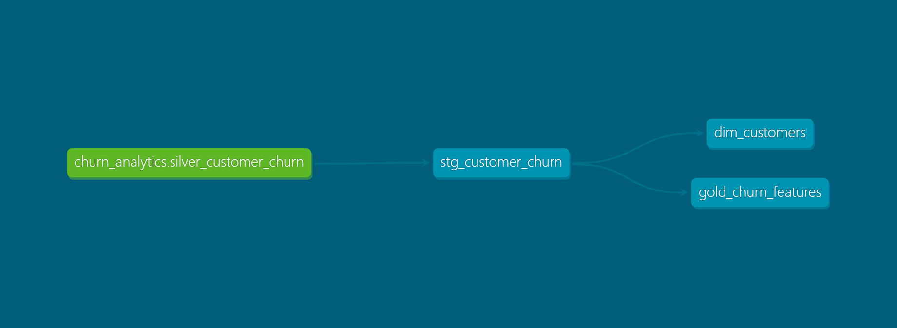

# End-to-End Data Engineering Platform for Customer Churn Analytics

## Overview
This project demonstrates an end-to-end data engineering and machine learning workflow using Databricks, SQL, dbt, and MLflow. The goal is to build a scalable analytics platform that ingests raw customer data, applies medallion-style transformations, and produces analytics-ready tables and churn features.

## Business Problem
Customer churn is a critical metric for subscription-based businesses. This project answers the question:

> Which customers are likely to churn in the next 30 days?

## Dataset

This project uses a real customer churn dataset sourced from Kaggle.

* Training records: 440,833
* Test records: 64,374
* Total records: ~505,000

The dataset includes demographic, subscription, engagement, support, and billing information used to predict customer churn.


## Architecture
The platform follows a Medallion Architecture:

- **Bronze**: Raw Delta tables ingested from CSV
- **Silver**: Cleaned and standardized Delta tables (type casting, deduplication)
- **Gold**: Gold: Analytics-ready dimensional models and machine learning feature tables built with dbt

Technologies used:
- Databricks (Spark, Delta Lake)
- SQL & Python
- dbt (analytics engineering)
- MLflow (model tracking)

## Data Flow
1. Raw data is ingested into Delta Lake (Bronze)
2. Data is cleaned and standardized (Silver)
3. Business models and feature tables are created (Gold)
4. A machine learning model is trained and logged using MLflow
5. Batch predictions are written as Delta tables

## dbt Lineage


## How to Run This Project

### Prerequisites
- Databricks Free Edition
- Python 3.10+
- dbt (databricks adapter)
- Git

### Steps
1. Clone the repository
2. Upload the raw CSV data to Databricks Volumes
3. Run the Bronze → Silver → Gold Databricks notebooks in order
4. Configure `profiles.yml` for dbt Databricks connection
5. Run:
   ```bash
   dbt run
   dbt test
   dbt docs generate
   ```

## Machine Learning Results

Two machine learning models were evaluated using Spark ML and tracked with MLflow.

### Models Evaluated

| Model | Validation AUC | Holdout AUC |
|---------|---------:|---------:|
| Logistic Regression | 0.9322 | 0.7885 |
| Random Forest | 0.9719 | 0.7752 |

### Final Model

Logistic Regression was selected as the production model because it achieved the highest performance on an independent holdout dataset, demonstrating better generalization than Random Forest.

## Limitations
This project uses Databricks Free Edition, which does not support job scheduling or production clusters. Orchestration is simulated through notebook execution order and documentation.

## Repository Structure
See the folder structure for notebooks, dbt models, and documentation.

## Future Improvements
- Add job orchestration using Databricks Jobs or Airflow
- Deploy real-time inference API
- Add CI/CD for dbt

